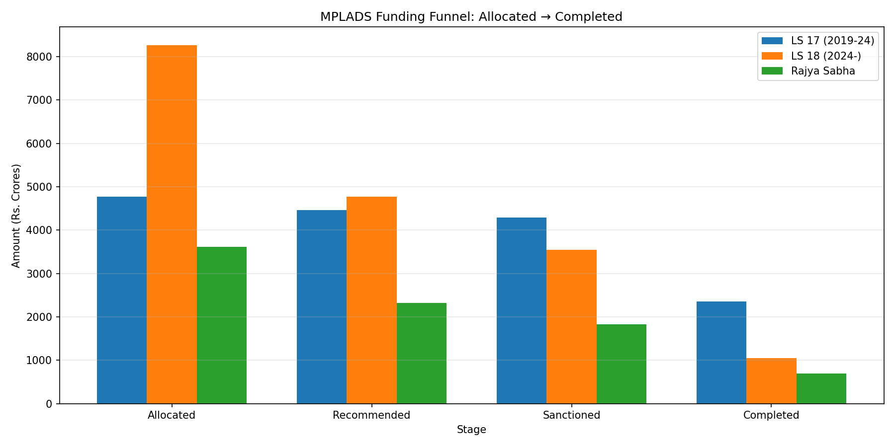
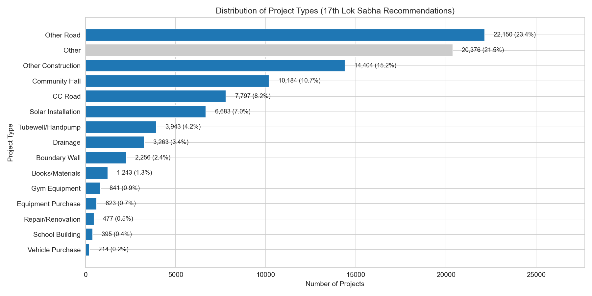
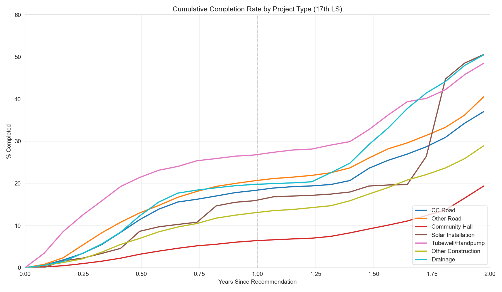
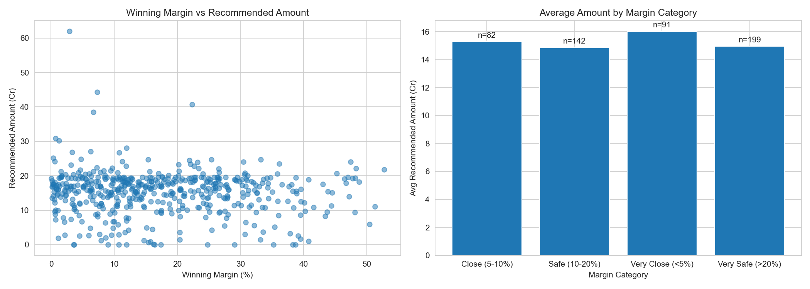
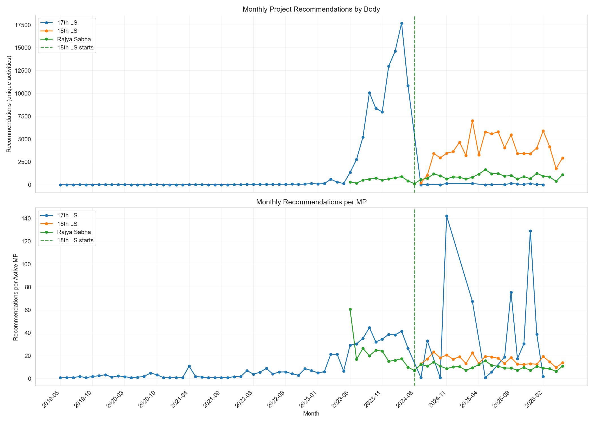

# MPLADS Data Collection & Analysis

Scrapes MP Local Area Development Scheme (MPLADS) spending data from the [eSAKSHI portal](https://mplads.mospi.gov.in) and analyzes spending patterns, including electoral competitiveness effects.

## Key Findings

### 1. The Money Gap

Most allocated funds never reach completion:

| Stage | 17th LS | 18th LS | RS |
|-------|---------|---------|-----|
| Allocated | 100% | 100% | 100% |
| Recommended | 94% | 58% | 64% |
| Sanctioned | 90% | 43% | 50% |
| Expenditure | 79% | 26% | 36% |
| Completed | 49% | 13% | 19% |



**Note on allocation amounts:** The 18th LS shows higher total allocation than 17th LS despite being a shorter tenure. This is because eSAKSHI went live in April 2023, so 17th LS data only captures ~1 year (FY 2023-24) of their 5-year term, while 18th LS has ~2 full years (Jun 2024 - present). The percentages in the table above are still meaningful as they show conversion rates within each tenure's captured data.

The 17th LS shows higher completion rates because projects had more time to reach completion (recommendation data from Apr 2023 - May 2024, with completion tracking through May 2026). For 18th LS (ongoing since Jun 2024), many projects are still in progress.

### 2. What Gets Funded

Project type distribution (17th LS, 186K recommendations):

| Type | % | Median Rs |
|------|---|-----------|
| Roads (CC + other) | 32% | 3.5-4.0L |
| Other Construction | 15% | 4.0L |
| Community Hall | 10.5% | 5.0L |
| CC Road | 8% | 4.6L |
| Solar Installation | 7% | 0.2L |
| Tubewell/Handpump | 4% | 1.8L |



**Completion rates (survival-style, counting ALL recommendations):**

| Body | N | 1yr | 18mo | 2yr |
|------|---|-----|------|-----|
| 17th LS | 91K | 20% | 26% | 42% |
| 18th LS | 67K | 28% | 53% | — |
| Rajya Sabha | 22K | 33% | 44% | 55% |

**Note on Rajya Sabha:** RS data lacks tenure separation—all current MPs are pooled regardless of when their 6-year term started. RS completion rates are shown for reference but direct comparison with LS is not meaningful.

18th LS is completing projects much faster than 17th LS did (53% vs 26% at 18 months).

**By project type (17th LS):**

| Type | N | 1yr | 2yr |
|------|---|-----|-----|
| Tubewell/Handpump | 3.8K | 28% | 51% |
| Solar Installation | 6.6K | 16% | 53% |
| Other Road | 21.6K | 21% | 43% |
| CC Road | 7.5K | 19% | 40% |
| Community Hall | 9.4K | 7% | 22% |



Community halls have low completion (22% by 2 years) despite being 10% of recommendations—larger construction projects take longer and fail more often.

### 3. Political Incentives Don't Matter Much

**Competitive vs Safe Seats:** MPs in marginal seats should spend more to shore up support. Data shows no meaningful effect:

| Seat Type | N | Rec % | Exp % | Comp % |
|-----------|---|-------|-------|--------|
| Safe (>15%) | 191 | 56% | 26% | 12% |
| Competitive (5-15%) | 218 | 57% | 25% | 12% |
| Marginal (<5%) | 131 | 61% | 30% | 15% |

Correlation (margin vs completion): **r = -0.03**



**Party:** Some variation but high within-party variance (std dev ~15-19%) dominates:

| Party | N | Rec % | Exp % | Comp % |
|-------|---|-------|-------|--------|
| BJP | 237 | 54% | 25% | 12% |
| INC | 99 | 61% | 25% | 10% |
| SP | 38 | 63% | 37% | 17% |
| DMK | 22 | 65% | 34% | 19% |

**Experience/Tenure:** First-term vs returning MPs shows no significant difference.

**Election Year Effect:** Comparing pre-election (Dec 2023 - May 2024, 17th LS) vs post-election (Jun - Nov 2024, 18th LS):

| Period | Recs/MP/month | Completions/month |
|--------|---------------|-------------------|
| Pre-election (outgoing) | 35 | 1,604 |
| Post-election (new MPs) | 18 | 1,105 |

Outgoing MPs recommend 2x as much per MP as new MPs, and completions run 1.5x higher before elections. This suggests bureaucratic push to finish before transition rather than new MP enthusiasm.



### 4. Multivariate Results

From regression analysis predicting recommended amount (in Crores):

| Variable | Coefficient | p-value |
|----------|-------------|---------|
| Margin (per %) | -0.05 Cr | 0.03 |
| DMK (vs BJP) | +3.1 Cr | 0.03 |
| SHS (vs BJP) | -5.0 Cr | 0.002 |
| Incumbent | -0.24 Cr | 0.75 |
| No. of Terms | -0.09 Cr | 0.73 |

Model R² = 0.05—these factors explain almost nothing.

**Bottom line:** MPLADS spending is a bureaucratic/capacity story, not a political incentives story.

### Fund Rules

MPLADS funds are **non-lapsable**:
- Unspent funds roll over to subsequent years (no "use it or lose it" pressure)
- When an MP's term ends, unreleased funds first complete the former MP's recommendations, then transfer to successor
- Since 2024, interest on MPLADS funds must be remitted to Consolidated Fund of India

This reduces urgency to spend before term ends—MPs can recommend projects knowing funds will be available even if completion extends beyond their tenure.

**Funds at 17th LS Transition (2024):**

| Metric | Amount |
|--------|--------|
| Total allocated | Rs 4,768 Cr |
| Total expenditure | Rs 3,783 Cr |
| **Unspent (rolled over)** | **Rs 985 Cr (21%)** |

Distribution: 377 MPs (68%) left <25% unspent, while 38 MPs (7%) left >50% unspent.

Since funds are non-lapsable, the Rs 985 Cr rolled over to complete pending 17th LS projects, then transferred to successor MPs.

---

## Data Coverage

| Body | Tenure | MPs | Work Records |
|------|--------|-----|--------------|
| Lok Sabha 18th | 2024-present | 554 | 184K (compressed) |
| Lok Sabha 17th | 2019-2024 | 557 | 263K (compressed) |
| Rajya Sabha | Current | 219 | 62K (compressed) |

Note: Rajya Sabha data is not tenure-separated in the portal API. All current RS MPs are fetched together, with individual tenure info (e.g., "2020-26") embedded in MP names.

## Data Processing Notes

### Understanding the Data Structure

The work-level data has a **workflow pipeline** structure with 3 stages stored as separate rows:

| Stage (tile_label) | Records (17th LS) | Has REC_DATE | Has COMP_DATE | Has RECOMMENDED_AMT | Has ACTUAL_AMT |
|--------------------|-------------------|--------------|---------------|---------------------|----------------|
| Works Recommended | 95K | ✓ (99%) | ✗ | ✓ (99%) | ✗ |
| Works Sanctioned | 92K | ✓ (99%) | ✗ | ✓ (99%) | ✗ |
| Works Completed | 55K | ✗ | ✓ (99%) | ✗ | ✓ (99%) |

**Critical:** No record has BOTH dates - they are always separate rows representing different workflow stages.

Records are linked via a composite key `(WORK_RECOMMENDATION_DTL_ID, mp_id)`, not `ACTIVITY_NAME` (which is a category label like "Construction of roads"). **Note:** `WORK_RECOMMENDATION_DTL_ID` is unique **per-MP**, not globally—the same ID value can appear under different MPs for different projects.

| WORK_RECOMMENDATION_DTL_ID | mp_id | tile_label | RECOMMENDATION_DATE | ACTUAL_END_DATE |
|----------------------------|-------|------------|--------------------|--------------------|
| 12345 | 100 | Works Recommended | 15-Jul-2023 | — |
| 12345 | 100 | Works Completed | — | 20-Mar-2024 |
| 12345 | 200 | Works Recommended | 10-Aug-2023 | — |  ← Different project, same ID

To compute time-to-completion, we join on `(WORK_RECOMMENDATION_DTL_ID, mp_id)`. Records missing WORK_RECOMMENDATION_DTL_ID cannot be linked across the funnel.

### Known Data Issues

**1. Empty placeholder records (~557 per body)**
- ~0.6% of records have ALL fields as NaN (no WORK_ID, no amounts, no dates)
- Appear in all three workflow stages with same count
- **Handling:** Dropped by zero-amount filter (only applied to Works Recommended stage)

**2. WORK_RECOMMENDATION_DTL_ID is MP-scoped**
- The same `WORK_RECOMMENDATION_DTL_ID` value can appear under different MPs
- These are NOT duplicates—the ID is unique per-MP, not globally
- Example: ID=201 under MP_A is a community hall; ID=201 under MP_B is a street light
- **Handling:** Use composite key `(WORK_RECOMMENDATION_DTL_ID, mp_id)` for linking

**3. Different amounts per stage**
- `RECOMMENDED_AMOUNT` only populated for Recommended/Sanctioned stages
- `ACTUAL_AMOUNT` only populated for Completed stage
- **Handling:** Use appropriate amount column per stage; don't filter completion records by RECOMMENDED_AMOUNT

**4. ACTIVITY_NAME is NOT a unique identifier**
- It's a category label (e.g., "Construction of roads")
- Same ACTIVITY_NAME appears 100s of times across different projects
- **Handling:** Use `WORK_RECOMMENDATION_DTL_ID` for linking, not ACTIVITY_NAME

**5. Negative completion times (~1,000 records)**
- Some projects show completion date BEFORE recommendation date
- Likely date entry errors or backdated completions
- **Handling:** Filtered out in completion time analysis (require days_to_complete > 0)

**6. Data sparsity (Apr-Jun 2023)**
- eSAKSHI portal went live April 2023
- Early months have ~3K records vs ~180K for later months
- **Handling:** Kept but noted; survival analysis accounts for time available

### Cleaning Strategy

**Stage-aware cleaning:** Different stages have different fields populated, so we apply rules appropriately:
- Zero-amount filter: Only for Works Recommended (completion records legitimately have RECOMMENDED_AMOUNT=0)
- Zero-amount filter: Only for Works Completed (recommendation records legitimately have ACTUAL_AMOUNT=0)

| Rule | Applied To | Records Affected (17th LS) |
|------|-----------|------------------|
| Zero RECOMMENDED_AMOUNT | Works Recommended | ~562 |
| Zero ACTUAL_AMOUNT | Works Completed | ~562 |
| Invalid dates (pre-2019, post-2030) | All stages | ~0 |

**Result:** 99.5% retention (241K of 242K records for 17th LS)

### Cleaning Summary

| Dataset | Original | Dropped | Retained | Retention |
|---------|----------|---------|----------|-----------|
| 17th Lok Sabha | 242,358 | 1,124 | 241,234 | 99.5% |
| 18th Lok Sabha | 179,415 | 1,106 | 178,309 | 99.4% |
| Rajya Sabha | 58,995 | 440 | 58,555 | 99.3% |

### Reproducibility

All cleaning is applied via `analysis/_data.py`:

```python
from analysis._data import load_works_data

# Load cleaned data (default)
df, stats = load_works_data("ls17", clean=True)

# Separate workflow stages for analysis
rec_df = df[df["tile_label"] == "Works Recommended"]
comp_df = df[df["tile_label"] == "Works Completed"]

# Link using composite key (WORK_RECOMMENDATION_DTL_ID is per-MP, not global)
link_cols = ["WORK_RECOMMENDATION_DTL_ID", "mp_id"]
merged = rec_df.merge(comp_df, on=link_cols, suffixes=("_rec", "_comp"))

# Load raw data for validation
df_raw, _ = load_works_data("ls17", clean=False)

# Optionally drop future dates
df_strict, stats = load_works_data("ls17", drop_future_dates=True)
```

Run validation to see full cleaning report:
```bash
uv run python analysis/00a_data_validation.py
```

## Project Structure

```
mplads/
├── src/                    # Scraping scripts
│   ├── _client.py          # Shared HTTP client, caching, throttling
│   ├── fetch_mplads.py     # Lok Sabha aggregate spending
│   ├── fetch_mplads_rs.py  # Rajya Sabha aggregate spending
│   ├── fetch_works.py      # Work-level details (LS)
│   ├── fetch_works_rs.py   # Work-level details (RS)
│   ├── fetch_elections.py  # Election results (margins, competitiveness)
│   ├── consolidate.py      # Combine tenure files
│   ├── check_data.py       # Check data collection progress
│   └── export_cache.py     # Export cache to CSV
├── analysis/               # Analysis scripts (run in order: 00 → 01 → 02 → 03)
│   ├── _config.py          # Shared constants (colors, labels)
│   ├── 00_descriptive_stats.py   # Descriptive stats & visualizations
│   ├── 01_merge_election_mplads.py   # Merge MPLADS with election data
│   ├── 02_electoral_targeting.ipynb  # Electoral targeting regression analysis
│   └── 03_project_analysis.ipynb     # Project type analysis
└── data/                   # Output files
    ├── mplads_18ls.csv
    ├── mplads_17ls.csv
    ├── mplads_rs.csv
    ├── mplads_aggregate.csv
    ├── works_ls18.csv.tar.gz
    ├── works_ls17.csv.tar.gz
    ├── works_rs.csv.tar.gz
    ├── elections/
    ├── final/
    └── raw/                # JSONL caches
```

## Quick Start

```bash
uv sync

# Fetch Lok Sabha aggregate spending data
uv run python src/fetch_mplads.py --tenure-id 7 --house 2 --out data/mplads_18ls.csv   # 18th LS
uv run python src/fetch_mplads.py --tenure-id 5 --house 2 --out data/mplads_17ls.csv   # 17th LS

# Fetch Rajya Sabha aggregate spending data
uv run python src/fetch_mplads_rs.py --out data/mplads_rs.csv

# Fetch work-level details
uv run python src/fetch_works.py --input data/mplads_18ls.csv --out data/works_ls18.csv
uv run python src/fetch_works.py --input data/mplads_17ls.csv --out data/works_ls17.csv
uv run python src/fetch_works_rs.py --input data/mplads_rs.csv --out data/works_rs.csv

# Fetch election results
uv run python src/fetch_elections.py

# Consolidate into single files
uv run python src/consolidate.py

# Analysis pipeline (run in order)
uv run python analysis/00_descriptive_stats.py      # Descriptive stats
uv run python analysis/01_merge_election_mplads.py  # Merge with election data
uv run jupyter execute analysis/02_electoral_targeting.ipynb  # Regression analysis
```

## Data Files

### Aggregate CSVs
- `mplads_18ls.csv` - 18th Lok Sabha MP spending (554 MPs)
- `mplads_17ls.csv` - 17th Lok Sabha MP spending (557 MPs)
- `mplads_rs.csv` - Rajya Sabha MP spending (219 MPs)
- `mplads_aggregate.csv` - Combined file

**Columns:** `tenure_label`, `house`, `state_id`, `state_name`, `constituency_id`, `constituency_name`, `mp_id`, `mp_name`, `allocated_cr`, `recommended_cr`, `sanctioned_cr`, `completed_cr`, `expenditure_cr`, `n_recommended`, `n_sanctioned`, `n_completed`

### Work-level Archives
- `works_ls18.csv.tar.gz` - 184K individual project records
- `works_ls17.csv.tar.gz` - 263K individual project records
- `works_rs.csv.tar.gz` - 62K individual project records

### Elections
- `elections/elections_18ls.csv` - 2024 election results with margins
- `elections/elections_17ls.csv` - 2019 election results with margins

**Competitiveness classification:**
- `safe`: margin > 15%
- `competitive`: margin 5-15%
- `marginal`: margin < 5%

### Visualizations
- `fig_01_funnel.png` - Funding funnel by tenure
- `fig_02_distributions.png` - Completion rate distributions
- `fig_03_percentiles.png` - Per-MP distribution violin plots
- `fig_04_scatter.png` - Recommended vs completed scatter
- `fig_05_margin.png` - Electoral margin analysis
- `fig_06_party.png` - Party-wise allocation
- `fig_07_incumbent.png` - Incumbent vs first-term comparison
- `fig_08_project_types.png` - Project type distribution
- `fig_09_completion_time.png` - Completion time by project type
- `fig_10_survival_completion.png` - Cumulative completion by project type
- `fig_11_monthly_recommendations.png` - Monthly recommendations timeline
- `fig_12_monthly_completions.png` - Monthly completions timeline

## Technical Notes

### API Architecture
The eSAKSHI portal exposes REST endpoints at `https://mplads.mospi.gov.in/rest/PreLoginDashboardData/`:
- `getStateData` - List of states
- `getConstituencyData` - Constituencies per state
- `getMpAndConstCombo` - MPs per constituency (LS)
- `getMpNamesData` - MPs per state (RS)
- `getTilesData` - Aggregate spending tiles
- `getTilesReportData` - Work-level details

**Lok Sabha API format:**
- MPs: `getMpAndConstCombo` with `const_combo = "constituency_id,2,tenure_id"`
- Tiles: `getTilesData` with `uname = "state_id,const_id,mp_id,2,tenure_id"`

**Rajya Sabha API format:**
- MPs: `getMpNamesData` with `state_combo = "state_id,1"`
- Tiles: `getTilesData` with `uname = "state_id,0,mp_id,1"` (no tenure parameter)

Requires session cookies from `/digigov/dashboard.html`.

### Caching & Resumability
Scripts use JSONL caches (`data/raw/*.jsonl`) for resumability. Re-running skips already-fetched data.

### Rate Limiting
Server rate-limits aggressively. Scripts use exponential backoff with base 10s delay and re-authenticate after multiple failures.

### Data Recency
The eSAKSHI portal (live since April 2023) only has data for FY 2023-24 onward. Historical spending for earlier years is not available.

### Data Model
Primary key is (mp_id, tenure_id, house). Same MP across tenures = separate rows.

## License

Data sourced from [eSAKSHI](https://mplads.mospi.gov.in), a Government of India portal.
