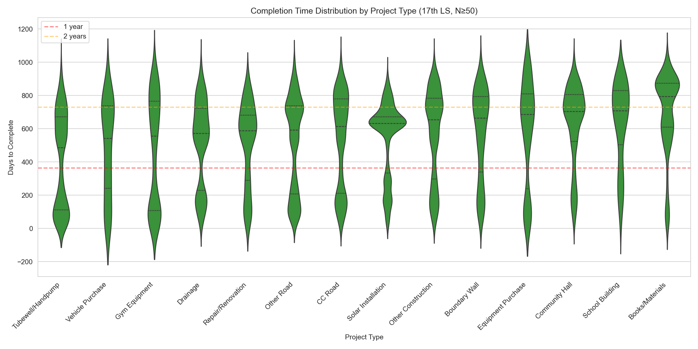

# MPLADS Data Collection & Analysis

Scrapes MP Local Area Development Scheme (MPLADS) spending data from the [eSAKSHI portal](https://mplads.mospi.gov.in) and analyzes spending patterns, including electoral competitiveness effects.

## Key Findings

### 1. The Money Gap

Most allocated funds never reach completion:

| Stage | 17th LS | 18th LS | RS |
|-------|---------|---------|-----|
| Allocated | 100% | 100% | 100% |
| Recommended | 94% | 58% | 64% |
| Sanctioned | 90% | 43% | 50% |
| Expenditure | 79% | 26% | 36% |
| Completed | 49% | 13% | 19% |


The 17th LS (2019-24) shows higher rates because MPs had a full 5-year term. For the 18th LS (ongoing), expenditure is a better progress measure than completion since works take time to finish.

### 2. What Gets Funded

Project type distribution (17th LS, 186K recommendations):

| Type | % | Median Rs |
|------|---|-----------|
| Roads (CC + other) | 32% | 3.5-4.0L |
| Other Construction | 15% | 4.0L |
| Community Hall | 10.5% | 5.0L |
| CC Road | 8% | 4.6L |
| Solar Installation | 7% | 0.2L |
| Tubewell/Handpump | 4% | 1.8L |


**Completion time by project type:**



Vehicle purchases (542d median) take nearly as long as CC roads (621d). Purchases take **106%** as long as construction. Completion time is driven by bureaucratic process, not project complexity.

### 3. Political Incentives Don't Matter Much

**Lok Sabha vs Rajya Sabha:** LS MPs have direct electoral accountability. If political incentives drove spending, LS should outperform RS. Data is mixed—17th LS (94% recommended) beats RS (64%), but RS completion (19%) is closer to 18th LS (13%) than 17th LS (49%). Tenure maturity dominates.

**Competitive vs Safe Seats:** MPs in marginal seats should spend more to shore up support. Data shows no meaningful effect:

| Seat Type | N | Rec % | Exp % | Comp % |
|-----------|---|-------|-------|--------|
| Safe (>15%) | 191 | 56% | 26% | 12% |
| Competitive (5-15%) | 218 | 57% | 25% | 12% |
| Marginal (<5%) | 131 | 61% | 30% | 15% |

Correlation (margin vs completion): **r = -0.03**


**Party:** Some variation but high within-party variance (std dev ~15-19%) dominates:

| Party | N | Rec % | Exp % | Comp % |
|-------|---|-------|-------|--------|
| BJP | 237 | 54% | 25% | 12% |
| INC | 99 | 61% | 25% | 10% |
| SP | 38 | 63% | 37% | 17% |
| DMK | 22 | 65% | 34% | 19% |

**Experience/Tenure:** First-term vs returning MPs shows no significant difference.

### 4. Multivariate Results

From regression analysis predicting recommended amount (in Crores):

| Variable | Coefficient | p-value |
|----------|-------------|---------|
| Margin (per %) | -0.05 Cr | 0.03 |
| DMK (vs BJP) | +3.1 Cr | 0.03 |
| SHS (vs BJP) | -5.0 Cr | 0.002 |
| Incumbent | -0.24 Cr | 0.75 |
| No. of Terms | -0.09 Cr | 0.73 |

Model R² = 0.05—these factors explain almost nothing.

**Bottom line:** MPLADS spending is a bureaucratic/capacity story, not a political incentives story.

---

## Data Coverage

| Body | Tenure | MPs | Work Records |
|------|--------|-----|--------------|
| Lok Sabha 18th | 2024-present | 554 | 184K (compressed) |
| Lok Sabha 17th | 2019-2024 | 557 | 263K (compressed) |
| Rajya Sabha | Current | 219 | 62K (compressed) |

Note: Rajya Sabha data is not tenure-separated in the portal API. All current RS MPs are fetched together, with individual tenure info (e.g., "2020-26") embedded in MP names.

## Project Structure

```
mplads/
├── src/                    # Scraping scripts
│   ├── _client.py          # Shared HTTP client, caching, throttling
│   ├── fetch_mplads.py     # Lok Sabha aggregate spending
│   ├── fetch_mplads_rs.py  # Rajya Sabha aggregate spending
│   ├── fetch_works.py      # Work-level details (LS)
│   ├── fetch_works_rs.py   # Work-level details (RS)
│   ├── fetch_elections.py  # Election results (margins, competitiveness)
│   ├── consolidate.py      # Combine tenure files
│   ├── check_data.py       # Check data collection progress
│   └── export_cache.py     # Export cache to CSV
├── analysis/               # Analysis scripts (run in order: 00 → 01 → 02 → 03)
│   ├── _config.py          # Shared constants (colors, labels)
│   ├── 00_descriptive_stats.py   # Descriptive stats & visualizations
│   ├── 01_merge_election_mplads.py   # Merge MPLADS with election data
│   ├── 02_electoral_targeting.ipynb  # Electoral targeting regression analysis
│   └── 03_project_analysis.ipynb     # Project type analysis
└── data/                   # Output files
    ├── mplads_18ls.csv
    ├── mplads_17ls.csv
    ├── mplads_rs.csv
    ├── mplads_aggregate.csv
    ├── works_ls18.csv.tar.gz
    ├── works_ls17.csv.tar.gz
    ├── works_rs.csv.tar.gz
    ├── elections/
    ├── final/
    └── raw/                # JSONL caches
```

## Quick Start

```bash
uv sync

# Fetch Lok Sabha aggregate spending data
uv run python src/fetch_mplads.py --tenure-id 7 --house 2 --out data/mplads_18ls.csv   # 18th LS
uv run python src/fetch_mplads.py --tenure-id 5 --house 2 --out data/mplads_17ls.csv   # 17th LS

# Fetch Rajya Sabha aggregate spending data
uv run python src/fetch_mplads_rs.py --out data/mplads_rs.csv

# Fetch work-level details
uv run python src/fetch_works.py --input data/mplads_18ls.csv --out data/works_ls18.csv
uv run python src/fetch_works.py --input data/mplads_17ls.csv --out data/works_ls17.csv
uv run python src/fetch_works_rs.py --input data/mplads_rs.csv --out data/works_rs.csv

# Fetch election results
uv run python src/fetch_elections.py

# Consolidate into single files
uv run python src/consolidate.py

# Analysis pipeline (run in order)
uv run python analysis/00_descriptive_stats.py      # Descriptive stats
uv run python analysis/01_merge_election_mplads.py  # Merge with election data
uv run jupyter execute analysis/02_electoral_targeting.ipynb  # Regression analysis
```

## Data Files

### Aggregate CSVs
- `mplads_18ls.csv` - 18th Lok Sabha MP spending (554 MPs)
- `mplads_17ls.csv` - 17th Lok Sabha MP spending (557 MPs)
- `mplads_rs.csv` - Rajya Sabha MP spending (219 MPs)
- `mplads_aggregate.csv` - Combined file

**Columns:** `tenure_label`, `house`, `state_id`, `state_name`, `constituency_id`, `constituency_name`, `mp_id`, `mp_name`, `allocated_cr`, `recommended_cr`, `sanctioned_cr`, `completed_cr`, `expenditure_cr`, `n_recommended`, `n_sanctioned`, `n_completed`

### Work-level Archives
- `works_ls18.csv.tar.gz` - 184K individual project records
- `works_ls17.csv.tar.gz` - 263K individual project records
- `works_rs.csv.tar.gz` - 62K individual project records

### Elections
- `elections/elections_18ls.csv` - 2024 election results with margins
- `elections/elections_17ls.csv` - 2019 election results with margins

**Competitiveness classification:**
- `safe`: margin > 15%
- `competitive`: margin 5-15%
- `marginal`: margin < 5%

### Visualizations
- `fig_01_funnel.png` - Funding funnel by tenure
- `fig_02_distributions.png` - Completion rate distributions
- `fig_03_percentiles.png` - Per-MP distribution violin plots
- `fig_04_scatter.png` - Recommended vs completed scatter
- `fig_05_margin.png` - Electoral margin analysis
- `fig_06_party.png` - Party-wise allocation
- `fig_07_incumbent.png` - Incumbent vs first-term comparison
- `fig_08_project_types.png` - Project type distribution
- `fig_09_completion_time.png` - Completion time by project type

## Technical Notes

### API Architecture
The eSAKSHI portal exposes REST endpoints at `https://mplads.mospi.gov.in/rest/PreLoginDashboardData/`:
- `getStateData` - List of states
- `getConstituencyData` - Constituencies per state
- `getMpAndConstCombo` - MPs per constituency (LS)
- `getMpNamesData` - MPs per state (RS)
- `getTilesData` - Aggregate spending tiles
- `getTilesReportData` - Work-level details

**Lok Sabha API format:**
- MPs: `getMpAndConstCombo` with `const_combo = "constituency_id,2,tenure_id"`
- Tiles: `getTilesData` with `uname = "state_id,const_id,mp_id,2,tenure_id"`

**Rajya Sabha API format:**
- MPs: `getMpNamesData` with `state_combo = "state_id,1"`
- Tiles: `getTilesData` with `uname = "state_id,0,mp_id,1"` (no tenure parameter)

Requires session cookies from `/digigov/dashboard.html`.

### Caching & Resumability
Scripts use JSONL caches (`data/raw/*.jsonl`) for resumability. Re-running skips already-fetched data.

### Rate Limiting
Server rate-limits aggressively. Scripts use exponential backoff with base 10s delay and re-authenticate after multiple failures.

### Data Recency
The eSAKSHI portal (live since April 2023) only has data for FY 2023-24 onward. Historical spending for earlier years is not available.

### Data Model
Primary key is (mp_id, tenure_id, house). Same MP across tenures = separate rows.

## License

Data sourced from [eSAKSHI](https://mplads.mospi.gov.in), a Government of India portal.
